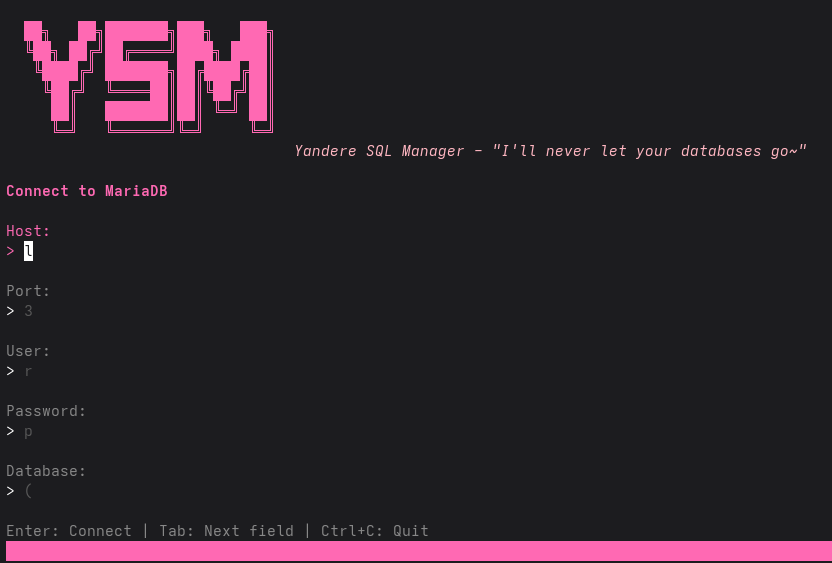

# YSM - Yandere SQL Manager

A TUI and CLI tool for managing MariaDB databases. *"I'll never let your databases go~"*



## Features

- **Interactive TUI** - Browse databases, tables, and data with a beautiful terminal interface
- **Import/Export** - Full support for `.sql`, `.sql.gz`, `.sql.xz`, and `.sql.zst` files
- **System Variables** - View, edit, and manage MariaDB session/global variables
- **Connection Profiles** - Save and manage multiple database connections with auto-applied settings
- **Query Editor** - Execute SQL queries directly from the TUI
- **Database Operations** - Clone, merge, copy, and diff databases
- **Buffered I/O** - Efficient handling of large database files

## Installation

### From Source

```bash
git clone https://github.com/blubskye/yandere_sql_manager.git
cd yandere_sql_manager
go build -o ysm ./cmd/ysm
```

### Dependencies

- Go 1.21+
- MariaDB/MySQL server
- Optional: `xz`, `zstd` for compression support

## Usage

### TUI Mode

```bash
# Launch interactive TUI
ysm tui

# Connect with specific credentials
ysm tui -H localhost -P 3306 -u root -p mypassword

# Use a saved profile
ysm tui --profile local
```

**TUI Key Bindings:**
| Key | Action |
|-----|--------|
| `Enter` | Select database/table |
| `/` | Filter list |
| `i` | Import SQL file |
| `e` | Export database |
| `s` | Open SQL query editor |
| `v` | Open system variables panel |
| `r` | Refresh |
| `Esc` | Go back |
| `q` | Quit |

### CLI Commands

#### Import

```bash
# Basic import
ysm import backup.sql -d mydb

# Import compressed file
ysm import backup.sql.zst -d mydb

# Create database if it doesn't exist
ysm import backup.sql -d mydb --create

# Rename database during import
ysm import backup.sql -d olddb --rename newdb

# Disable foreign key checks during import
ysm import backup.sql -d mydb --no-fk-checks

# Disable unique checks during import
ysm import backup.sql -d mydb --no-unique-checks

# Continue on errors
ysm import backup.sql -d mydb --continue
```

#### Export

```bash
# Basic export
ysm export mydb

# Export to specific file
ysm export mydb -o backup.sql

# Export with compression
ysm export mydb -o backup.sql.zst
ysm export mydb -o backup.sql.xz
ysm export mydb -o backup.sql.gz

# Export structure only (no data)
ysm export mydb --no-data

# Export specific tables
ysm export mydb --tables users,posts

# Include session variables in export
ysm export mydb --include-vars
```

#### System Variables

```bash
# Set a session variable
ysm set foreign_key_checks 0

# Set a global variable (requires SUPER privilege)
ysm set --global max_connections 200

# Show variables matching a pattern
ysm set --show "character%"

# Show a specific variable
ysm set --show foreign_key_checks

# List common variables with current values
ysm set --list
```

#### Connection Profiles

```bash
# Add a new profile
ysm profile add local -H localhost -P 3306 -u root -p mypassword

# List all profiles
ysm profile list

# Show profile details
ysm profile show local

# Set default profile
ysm profile use local

# Remove a profile
ysm profile remove local
```

#### Profile Variables

Profiles can store variables that are automatically applied when connecting:

```bash
# Set a variable for a profile
ysm profile set-var local foreign_key_checks 0
ysm profile set-var local sql_mode STRICT_TRANS_TABLES

# List variables for a profile
ysm profile vars local

# Remove a variable from a profile
ysm profile unset-var local foreign_key_checks
```

Example profile with variables in `~/.config/ysm/config.yaml`:
```yaml
profiles:
  local:
    host: localhost
    port: 3306
    user: root
    password: mypassword
    variables:
      foreign_key_checks: "0"
      sql_mode: "STRICT_TRANS_TABLES"
```

### Common MariaDB Variables

| Variable | Description | Common Values |
|----------|-------------|---------------|
| `foreign_key_checks` | Enable/disable FK constraints | 0, 1 |
| `unique_checks` | Enable/disable unique checks | 0, 1 |
| `sql_mode` | SQL behavior modes | STRICT_TRANS_TABLES |
| `autocommit` | Auto-commit transactions | 0, 1 |
| `wait_timeout` | Connection timeout (seconds) | 28800 |
| `max_allowed_packet` | Max packet size | 16777216 |
| `character_set_client` | Client character set | utf8mb4 |
| `time_zone` | Session timezone | +00:00, SYSTEM |

## Compression Support

YSM supports multiple compression formats for import/export:

| Format | Extension | Notes |
|--------|-----------|-------|
| gzip | `.gz` | Built-in Go support |
| xz | `.xz` | Requires `xz` command |
| zstd | `.zst` | Requires `zstd` command |

Compression is auto-detected from file extension.

## Configuration

Configuration is stored in `~/.config/ysm/config.yaml`:

```yaml
default_profile: local
profiles:
  local:
    host: localhost
    port: 3306
    user: root
    password: mypassword
    database: mydb
    variables:
      foreign_key_checks: "0"
  production:
    host: db.example.com
    port: 3306
    user: app
    password: secret
```

## License

This project is licensed under the GNU Affero General Public License v3.0 (AGPL-3.0).

See [LICENSE](LICENSE) for details.

## Source Code

https://github.com/blubskye/yandere_sql_manager
